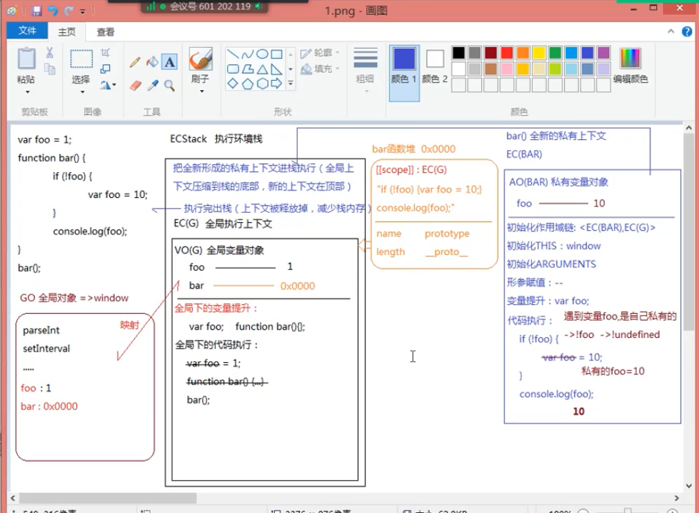

### **变量提升**

**变量提升：** 在当前上下文中(全局/私有/块级),JS代码自上而下执行之前，浏览器会提前处理一些事情(可以理解为词法解析的一个环节，词法解析一定发生在代码执行之前) 会把当前上下文中所带VAR/FUNCTION关键字的进行提前的声明或者定义

  声明declare: var a;   // 创建变量的过程
	定义defined：a=10;    // 赋值的过程

	带VAR的只会提前声明
	带FUNCTION的会提前的声明定义

**意义：**能够在创建代码之前使用这个变量而不报错

*代码执行之前：全局上下文中的变量提升*

	var a ; 默认值是undefined

	console.log(a);  // => undefined
	var a = 12;  // => 创建值12 不需要在声明a了  (变量提升阶段完成了，完成的事情不会重新处理) a=12赋值

	a = 13; // 全局变量 a = 13
	console.log(a);  // => 13

*全局上下文中的变量提升*

	func = 函数  函数在这个阶段赋值都做了

	func();

	function func() {
		var a = 12;
		console.log('ok');
	}

- 真实项目中建议用函数表达式创建函数，因为这样在变量提升阶段只会声明FUNC，不会赋值

func();  // => Uncaught TypeError: func is not a function

var func = function () {
	// 真实项目中建议用函数表达式创建函数，因为这样在变量提升阶段只会声明FUNC，不会赋值
	console.log("OK");
}

func();

**匿名函数具名化**

- 把原本作为值的函数表达式匿名函数“具名化”（虽说是起了名字，但是这个名字不能在外面访问 => 也就是不会在当前上下文中创建这个名字）

- 当函数执行，在形成的私有上下文中，会把这个具名化得名字作为私有上下文中的变量（值就是这个函数）来进行处理

	var func = function AAA() {
		// 把原本作为值的函数表达式匿名函数“具名化”（虽说是起了名字，但是这个名字不能在外面访问 => 也就是不会在当前上下文中创建这个名字）
		// 当函数执行，在形成的私有上下文中，会把这个具名化得名字作为私有上下文中的变量（值就是这个函数）来进行处理
		console.log('OK')
		// console.log(AAA); // => 当前函数
		AAA();  // 递归调用    而不是严格模式下都不支持的 arguments.callee 了
	}

	// AAA();  // =>Uncaught ReferenceError : AAA is not defined

	func();

	setTimeout(function func(){
		func();
	},1000);

### EC(G)变量提升  只有VAR/FUNCTION会变量提升(ES6中的LET和CONST不会)

	console.log('OK');  // => 'OK'
 	console.log(a); // => Uncaught ReferenceError: Cannot access 'a' before initialization 不能在LET声明之前使用变量 （发生在代码执行阶段）
	
	let a = 12;
	a = 13

	console.log(a)

### 基于“VAR或者FUNCTION” 在“全局上下文”中声明的变量（全局变量）会“映射”到GO(全局对象window)上一份，作为他的属性；而且接下来是一个修改，另外一个也会跟着修改

var a = 12
console.log(a);  // => 12 全局变量
console.log(window.a); // => 12 映射到GO上的属性a

window.a = 13;
console.log(a); // => 13 映射机制是一个修改另一个也会修改

### EC(G): 全局上下文中的变量提升

- 不论条件是否成立，都要进行变量提升(细节点:条件中带FUNCTION的在新版本浏览器中只会提前声明，不会在提前的赋值了)

[老版本]
	var a;
	func = 函数
[新版本]

	var a;  全局上下文中声明一个a也相当于 window.a
	func;

console.log(a,func);  // =>undefined undefined
if(!("a" in window)){ 
	// => "a" in window 检测a是否为window的一个属性   !TRUE => FALSE
	var a = 1;
	function func() {}
}
console.log(a);  // => undefined

**EC(G)变量提升**

* fn=>1
*   =>2
* var fn;   已经声明过了
*   =>4
*   =>5
* 全局上下文中有一个全局变量fn,值是输出5的函数 (此时window.fn=>5)
*
	fn();  // => 5
	function fn(){console.log("1");}  //=>不再处理，变量提升阶段搞过了
	fn();  // => 5
	function fn(){console.log("2");}
	fn(); // => 5
	var fn= function(){console.log("3");}  // =>var fn不用在处理了，但是赋值在变量提升阶段没处理过，此处需要处理 fn=window.fn=>3
	fn(); // =>3
	function fn(){console.log("4");}
	fn(); // =>3
	function fn(){
		console.log("5");
	}
	fn(); // =>3

	----------------------------------------------------------------------------------------------------------------------------------

	var foo = 1;
	function bar(){
		if(!foo){
			var foo = 10;
		}
		console.log(foo);
	}
	bar();
		