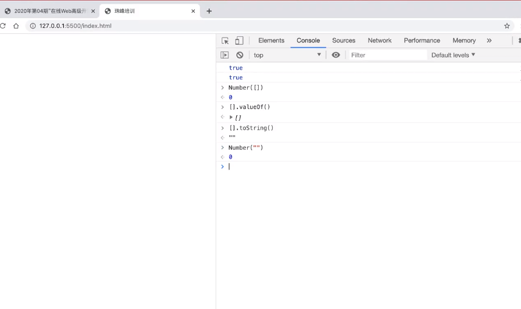

## **一、数据类型**
### **1. js中的数据类型**
- 基本数据类型
	+ number (数字类型中比较奇怪的值：1.NaN不是有效数字，但是属于number类型的。 console.log(typeof NaN);=>"number"; console.log(NaN === NaN); //=>false)  Object.is(NaN,NaN)  //检测两个值是否相等 => true

		2.想检测一个值是否为有效数字  判断方法为isNaN
		console.log(isNaN(10));  // => false
		console.log(isNaN('AA'));  // =>在检测的时候，如果当前这个值不是数字类型，先隐式转换为数字类型(Number)然后再检测是否为非有效数字 如果为非有效数字 true

		3. Infinity无穷大的值
		console.log(Infinity);
	+ string
	+ boolean
	+ null
	+ undefined
	+ symbol  (Symbol([value])):创建唯一值,不可以new  console.log(Symbol('A')==Symbol('A')) // false
	+ bigint   大数据值；Js存在最大和最小安全数字；
	console.log(Number.MAX_SAFE_INTEGER);  // => 9007199254740991
	console.log(Number.MIN_SAFE_INTEGER);  // => -9007199254740991
	(=> 9007199254740991n => bigint类型的)
- 引用数据类型
	+ object
		+ 普通对象 Map
		+ 实例对象
		+ 数组对象 Set
		+ 正则对象
		+ 日期对象
		+ Math 数学函数对象
		+ prototype原型对象
		+ ....
	+ function (class是类属函数)
	   
### **2. 数据类型检测（有且只有这四种，但还有其他检测具体数据雷=类型的方法如isNaN）**
- typeof 检测数据类型的逻辑运算符
- instanceof 检测是否为某个类的实例
- constructor 检测构造函数
- Object.prototype.toString.call([value]) 检测数据类型的

**特点**

  typeof[value] 返回当前值的数据类型  "数据类型"
	
	1.检测出来的结果是字符串，字符串中包含了我们对应的数据类型；
	2.typeof null 输出的测试数据类型为"object"但null为基本类型不属于对象，原因为计算机遗留bug，二进制存储以000开头了
	3.检测对象细分的类型结果都是"object"

- 返回结果都是字符串
- 局限性
	+ typeof null => "object"
	+ typeof 不能细分对象类型(检测普通对象或者数组对象都是"object")

**注意**

所有的值在内存中都是按照二进制存储的

### **3. 数据类型转换的4大核心标准**

**a. 把其他数据类型转换为Number类型**

- **特定需要转换为Number的**
	+ Number([val])
	+ parseInt/parseFloat([val])
- **隐式转换(浏览器内部默认要先转换为Number在进行计算的)**
	+ isNaN([val])
	+ 数学运算(特殊情况: +在出现字符串的情况下不是数字运算，是字符串拼接)
	+ 在==比较的时候，有些值需要转换为数字再进行比较
	+ ...

**b. 把其他数据类型转换为字符串**

- **能使用的办法**
	+ toString()
	+ String()

- **隐式转换(一般都是调用其toString)**

	+	加号运算的时候，如果其一边出现字符串，则是字符串拼接
	+ 把对象转换为数字，需要先toString()转换为字符串，再去转换为数字
	+ 基于alert/confirm/prompt/document.write...这些方式输出内容，都是把内容先转换为字符串，然后再输出的
	+ ...

**c. 把其他数据类型转换为布尔**

- **基于以下方式可以把其他数据类型转换为布尔**

	+ ! 转换为布尔值后取反
	+ !! 转换为布尔类型
	+ Boolean([val])

- **隐式转换**
	+ 在循环或者条件判断中，条件处理的结果就是布尔值类型值
	+ ...

***规则：*** 只有'0、NaN、null、undefined、空字符串'五个值会变为布尔值的FALSE,其余都是TRUE

**d. 在==比较的过程中，数据转换的规则**

**【类型一样的几个特殊点】**

		{}=={}: false 对象比较的是对内存的地址
		[]==[]: false 
		NaN==NaN: false

**【类型不一样的转换规则】**

-  null==undefined: true,但是换成===结果是false(因为类型不一致)，剩下null/undefined和其他任何数据类型值都不相等

-  字符串==对象 要把对象转换为字符串

-  剩下如果==两边数据类型不一致，都是需要转换为数字再进行比较

		console.log([] == false);
		// 对象==布尔  都转换为数字(隐式转换)
		// 对象转换为数字：先toString 转换为字符串(应该是先基于valueOf获得原始值，没有原始值再去toString),再转换为数字的
		// [] ——> '' ——> 0
		// false ——> 0   true ——> 1
		// => true
    

		console.log(![] == false);
		// ![] 把数组转换为布尔类型然后取反 false
		// false == false
		// => true

**转为字符串特点**

	

**把其他类型转换为字符串，一般都是直接""抱起来，只有{}普通对象调取toString是调取的Object.prototype.toString,不是转换为字符串，而是检测数据类型，返回结果是"[object Object]"**

### **4.parseInt的处理规则**

	let arr = [10.18,0,10,25,23];
	arr = arr.map(parseInt);
	console.log(arr);

	/*
		arr = arr.map((item,index)=>{
			// 循环遍历数组中的某一项就会触发回调函数
			// 每一次还会传递当前项和当前项的索引
		})；
	*/

	parseInt('10.18',0);

	parseInt('0',1); =>NaN
	parseInt('10',2)
	parseInt('25',3)
	parseInt('23',4)