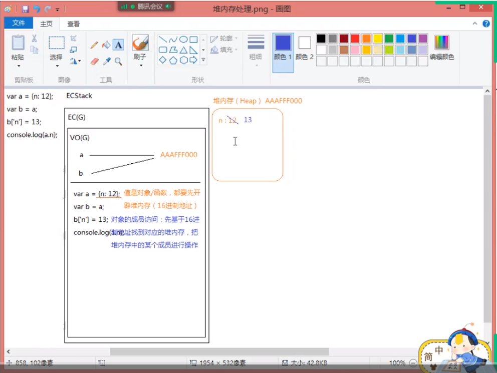

## **一、数据类型**
### **1. js中的数据类型**
- 基本数据类型
	+ number (数字类型中比较奇怪的值：1.NaN不是有效数字，但是属于number类型的。 console.log(typeof NaN);=>"number"; console.log(NaN === NaN); //=>false)  Object.is(NaN,NaN)  //检测两个值是否相等 => true

		2.想检测一个值是否为有效数字  判断方法为isNaN
		console.log(isNaN(10));  // => false
		console.log(isNaN('AA'));  // =>在检测的时候，如果当前这个值不是数字类型，先隐式转换为数字类型(Number)然后再检测是否为非有效数字 如果为非有效数字 true

		3. Infinity无穷大的值
		console.log(Infinity);
	+ string
	+ boolean
	+ null
	+ undefined
	+ symbol  (Symbol([value])):创建唯一值,不可以new  console.log(Symbol('A')==Symbol('A')) // false
	+ bigint   大数据值；Js存在最大和最小安全数字；
	console.log(Number.MAX_SAFE_INTEGER);  // => 9007199254740991
	console.log(Number.MIN_SAFE_INTEGER);  // => -9007199254740991
	(=> 9007199254740991n => bigint类型的)
- 引用数据类型
	+ object
		+ 普通对象 Map
		+ 实例对象
		+ 数组对象 Set
		+ 正则对象
		+ 日期对象
		+ Math 数学函数对象
		+ prototype原型对象
		+ ....
	+ function (class是类属函数)
	   
### **2. 数据类型检测（有且只有这四种，但还有其他检测具体数据雷=类型的方法如isNaN）**
- typeof 检测数据类型的逻辑运算符
- instanceof 检测是否为某个类的实例
- constructor 检测构造函数
- Object.prototype.toString.call([value]) 检测数据类型的

**特点**

  typeof[value] 返回当前值的数据类型  "数据类型"
	
	1.检测出来的结果是字符串，字符串中包含了我们对应的数据类型；
	2.typeof null 输出的测试数据类型为"object"但null为基本类型不属于对象，原因为计算机遗留bug，二进制存储以000开头了
	3.检测对象细分的类型结果都是"object"

- 返回结果都是字符串
- 局限性
	+ typeof null => "object"
	+ typeof 不能细分对象类型(检测普通对象或者数组对象都是"object")

**注意**

所有的值在内存中都是按照二进制存储的

### **3. 数据类型转换的4大核心标准**

**a. 把其他数据类型转换为Number类型**

- **特定需要转换为Number的**
	+ Number([val])
	+ parseInt/parseFloat([val])
- **隐式转换(浏览器内部默认要先转换为Number在进行计算的)**
	+ isNaN([val])
	+ 数学运算(特殊情况: +在出现字符串的情况下不是数字运算，是字符串拼接)
	+ 在==比较的时候，有些值需要转换为数字再进行比较
	+ ...

**b. 把其他数据类型转换为字符串**

- **能使用的办法**
	+ toString()
	+ String()

- **隐式转换(一般都是调用其toString)**

	+	加号运算的时候，如果其一边出现字符串，则是字符串拼接
	+ 把对象转换为数字，需要先toString()转换为字符串，再去转换为数字
	+ 基于alert/confirm/prompt/document.write...这些方式输出内容，都是把内容先转换为字符串，然后再输出的
	+ ...

**c. 把其他数据类型转换为布尔**

- **基于以下方式可以把其他数据类型转换为布尔**

	+ ! 转换为布尔值后取反
	+ !! 转换为布尔类型
	+ Boolean([val])

- **隐式转换**
	+ 在循环或者条件判断中，条件处理的结果就是布尔值类型值
	+ ...

***规则：*** 只有'0、NaN、null、undefined、空字符串'五个值会变为布尔值的FALSE,其余都是TRUE

**d. 在==比较的过程中，数据转换的规则**

**【类型一样的几个特殊点】**

		{}=={}: false 对象比较的是对内存的地址
		[]==[]: false 
		NaN==NaN: false

**【类型不一样的转换规则】**

-  null==undefined: true,但是换成===结果是false(因为类型不一致)，剩下null/undefined和其他任何数据类型值都不相等

-  字符串==对象 要把对象转换为字符串

-  剩下如果==两边数据类型不一致，都是需要转换为数字再进行比较

		console.log([] == false);
		// 对象==布尔  都转换为数字(隐式转换)
		// 对象转换为数字：先toString 转换为字符串(应该是先基于valueOf获得原始值，没有原始值再去toString),再转换为数字的
		// [] ——> '' ——> 0
		// false ——> 0   true ——> 1
		// => true
    

		console.log(![] == false);
		// ![] 把数组转换为布尔类型然后取反 false
		// false == false
		// => true

**转为字符串特点**

	

**把其他类型转换为字符串，一般都是直接""抱起来，只有{}普通对象调取toString是调取的Object.prototype.toString,不是转换为字符串，而是检测数据类型，返回结果是"[object Object]"**

### **4.parseInt的处理规则**

	let arr = [10.18,0,10,25,23];
	arr = arr.map(parseInt);
	console.log(arr);

	/*
		arr = arr.map((item,index)=>{
			// 循环遍历数组中的某一项就会触发回调函数
			// 每一次还会传递当前项和当前项的索引
		})；
	*/

	parseInt('10.18',0);
		从字符串左侧第一个字符开始查找，找到符合[radix]进制的值(遇到一个不合法的，则停止查找)，把找到的值变为数字，再按照把[radix]转换成为十进制的规则处理
		'10' -> 10
	parseInt('0',1); =>NaN
	parseInt('10',2)
		10 把它看做2进制，最后转换为10进制
		1*2^1 + 0*2^0 => 2

	parseInt('25',3)
		2 当做3进制转换为10进制
		2*3^0 => 2

	parseInt('23',4)
		23 当做4进制转换为10进制
		2*4^1 + 3*4^0 => 11

	---------------------------------------------------------------------------------------------------------
	parseInt([value],[radix])
	-> [radix]这个值是一个进制，不写或者写0默认都按照10处理(特殊情况：如果value是以0x开头，则默认值不是10而是16)
	-> 进制有一个取值的范围：2~36 之间，如果不在这之间，整个程序运行的结果一定是NaN
	-> 把[value]看做[radix]进制，最后把[radix]进制转化为十进制

	---------------------------------------------------------------------------------------------------------
	
	把一个值转换为十进制
	[位权值：每一位的权重，个位是0，十位是1...]

	147(八进制) => 十进制
	1*8^2 + 4*8^1 + 7*8^0

	12.23(四进制) => 十进制
	1*4^1 + 2*4^0 + 2*4^-1 + 3*4^-2
	4^0 = 1
	4^-1 = 1/4
	4^-2 = 1/(4*4);

## **二、js底层运行机制之堆(Heap)栈(Stack)内存**

### **1、栈内存**

		let a = 12;
		let b = 13;

		function func(){
			let a = 1;
			let b = 2;
		}

		func();

		console.log(a,b);

	注：图片中紫色重叠部分因空间不足导致覆盖于蓝色区域上

### **2、堆内存**

	var a = 12;
	var b = a;
	b = 13;
	console.log(a);

	var a = {n:12};
	var b = a;
	b['n'] = 13;
	console.log(a.n); 

	var a = {n:12};
	var b = a;
	b = {n:13};
	console.log(a.n)

**对象数据类型：由零到多组键值对（属性名和属性值）组成的**
**属性名的类型**
**【说法一：属性名类型只能是字符串或者Symbol】**
**【说法二：属性名类型可以是任何基本类型值，处理中可以和字符串互通】**
**但是属性名绝对不能是引用数据类型，如果设置引用类型，最后也是转换为字符串处理的**
**注：数组：以数字作为索引（索引就是属性名）**

**属性名类型示例：**
	
	let sy = symbol('AA');
	let x = {
		0:0
	}
	let obj = {
		0: 12,
		true: 'xxx',
		null: 20
	}
	obj[sy] = '珠峰';
	obj[x] = 100; // => obj['[object Object]']=100 会把对象变为字符串作为属性名

	for (let key in obj){
		// for in 遍历中获取的属性名都会变为字符串
		// 并且无法迭代到属性名是 symbol类型的属性
		console.log(key,typeof key);
	}
	//  0 string ;true string ; null string ; [object Object] string
	***在for in 循环中将key转为了字符串；属性名为symbol时遍历不到***

	let x = 20;
	let obj = {
		x: 100
	};
	// 属性名肯定得是一个值
	// obj[x] 把x变量存储的值当做属性名，获取对象的属性值 => obj[20] => undefined
	// obj['x']获取属性名为x的属性值 => 100 <=> obj.x 属性名为x

**example 1:**

	var a={}, b='0',c=0;
	a[b]='珠峰';  // a['0] = '珠峰'
	a[c]='培训';  // a[0] = '培训'
	console.log(a[b]);  // => "培训"

**example 2:**

	var a={}, b=Symbol('1'),c=Symbol('1');  // symbol唯一属性值，b !== c
	a[b]='珠峰'; 
	a[c]='培训';
	console.log(a[b]); // =>"珠峰"

**example 3:**

	var a={}, b={n:'1'},c={m:'2'};
	a[b]='珠峰'; // a['[object Object]']="珠峰"
	a[c]='培训';	// a['[object Object]']="培训"
	console.log(a[b]);   // =>"培训"

### **连等于赋值**

	let a = 12,
			b = 13;  // => let a=12; let b=13;

	// 从右到左
	// 1. 创建一个值12
	// 2. b = 12
	// 3. let a = 12
	let a = b = 12;

	// 运算符优先级
	https://developer.mozilla.org/zh-CN/docs/Web/JavaScript/Reference/Operators/Operator_Precedence#Table

	a.x = a = {};
	a = a.x = {};
	// 因为成员访问 a.x的优先级是很大的，所以不论怎么调换位置，都是先处理a.x={}
	
	var a = {
		n: 1
	};
	var b = a;
	a.x = a = {
		n: 2
	};

	console.log(a.x);
	console.log(b)

**堆内存嵌套**
	// 循环引用 不是内存溢出
	let x = {
		name: 'xxx'
	};
	console.log(x);

